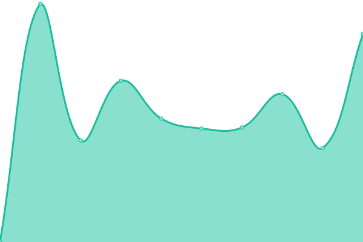

# [📈 Live Status](https://vulcain65.github.io/upptime): <!--live status--> **🟧 Partial outage**

This repository contains the open-source uptime monitor and status page for [vulcain65](https://vulcain65.github.io/upptime), powered by [Upptime](https://github.com/upptime/upptime).

With [Upptime](https://upptime.js.org), you can get your own unlimited and free uptime monitor and status page, powered entirely by a GitHub repository. We use [Issues](https://github.com/vulcain65/upptime/issues) as incident reports, [Actions](https://github.com/vulcain65/upptime/actions) as uptime monitors, and [Pages](https://vulcain65.github.io/upptime) for the status page.

<!--start: status pages-->
<!-- This summary is generated by Upptime (https://github.com/upptime/upptime) -->
<!-- Do not edit this manually, your changes will be overwritten -->
<!-- prettier-ignore -->
| URL | Status | History | Response Time | Uptime |
| --- | ------ | ------- | ------------- | ------ |
|  [e-berga](https://e-berga.info) | 🟥 Down | [e-berga.yml](https://github.com/vulcain65/upptime/commits/HEAD/history/e-berga.yml) | 

 860ms
     
 | 

<a href="https://vulcain65.github.io/upptime/history/e-berga">100.00%</a>
    

|  [motards-en-voyage](https://motards-en-voyage.com//robots.txt) | 🟩 Up | [motards-en-voyage.yml](https://github.com/vulcain65/upptime/commits/HEAD/history/motards-en-voyage.yml) | 

 636ms
     
 | 

<a href="https://vulcain65.github.io/upptime/history/motards-en-voyage">100.00%</a>
    

|  [b.emdayo](https://b.emdayo.fr/) | 🟩 Up | [b-emdayo.yml](https://github.com/vulcain65/upptime/commits/HEAD/history/b-emdayo.yml) | 

 1702ms
     
 | 

<a href="https://vulcain65.github.io/upptime/history/b-emdayo">100.00%</a>
    

<!--end: status pages-->

[**Visit our status website →**](https://vulcain65.github.io/upptime)

## 📄 License

- Powered by: [Upptime](https://github.com/upptime/upptime)
- Code: [MIT](./LICENSE) © [vulcain65](https://vulcain65.github.io/upptime)
- Data in the `./history` directory: [Open Database License](https://opendatacommons.org/licenses/odbl/1-0/)
